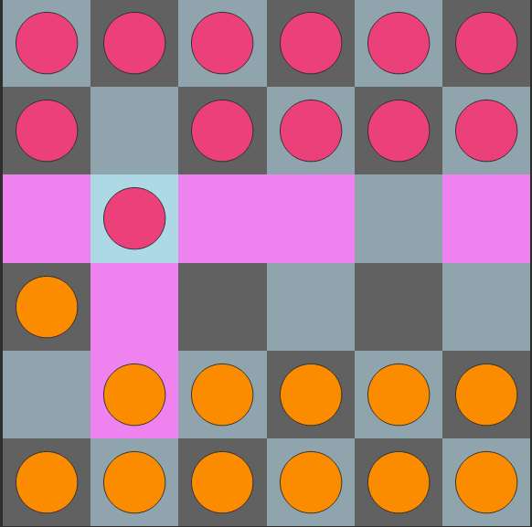
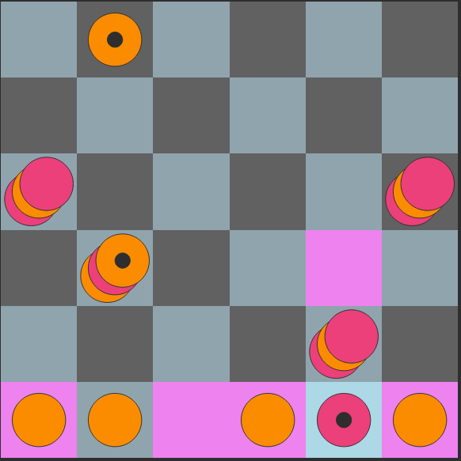
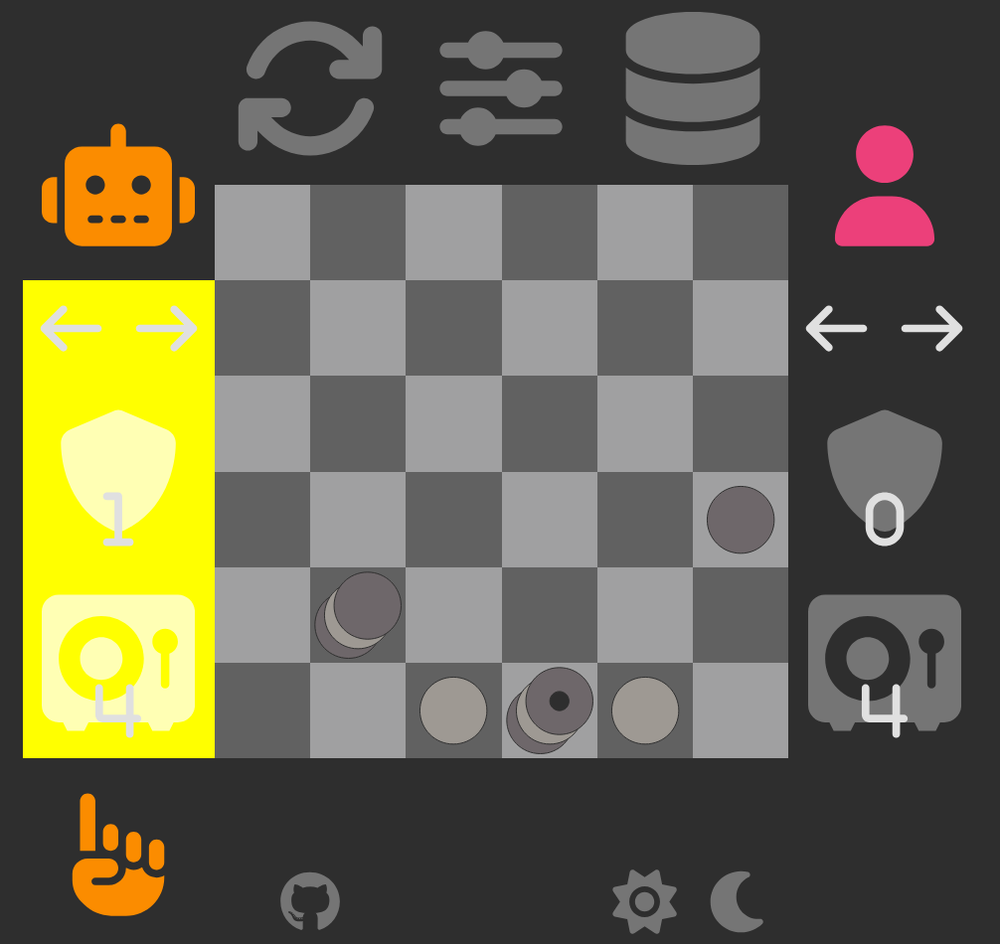
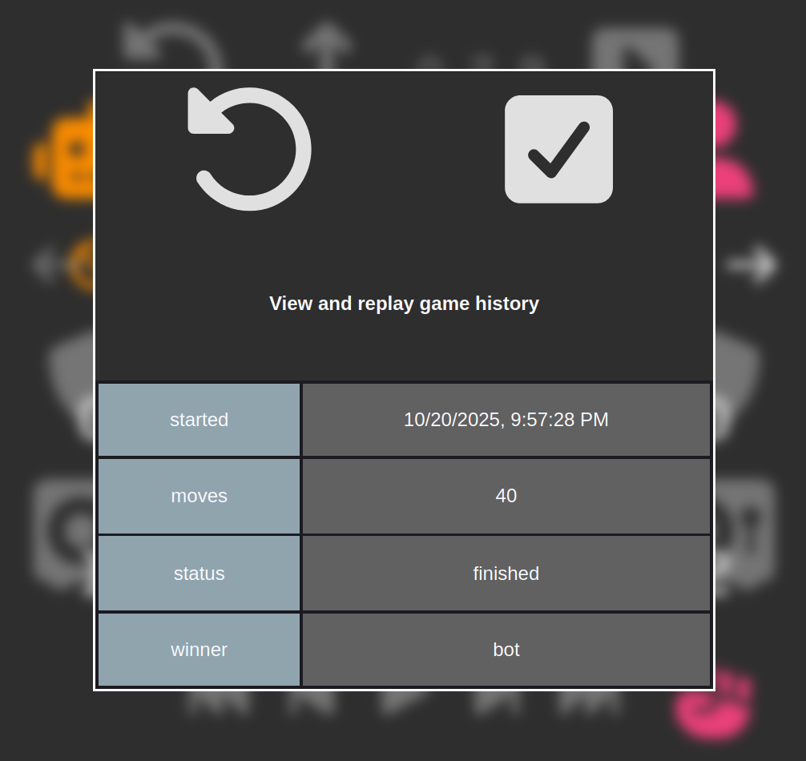
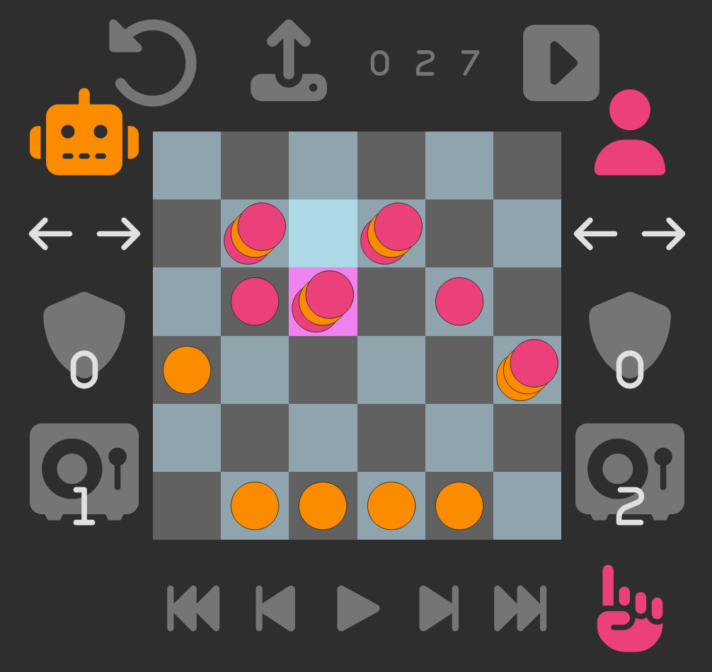

# StackOrBolt

A classic two player turn-based board game with an ai opponent.
<a href="https://regen-donedev.github.io/StackOrBolt/">Play online</a>

## Game Rules

Move a piece one or two cells forward or sideward
onto an empty cell or opponent's piece.
You can wraparound the board for sideward moves,
but two consecutive sideward moves are not allowed.

To conquer opponent material, simply stack your
piece on top of the opponent's and its yours to own (for now).

Single stones or stacked pieces are called **"towers"**
which are limited to three stones in total by default.
If the max stack size exceeds for a move, all obsolete stones
are removed from the board in a FIFO manner and the opponent's will be  
credited to the player's vault.  
All stones for a tower are coupled to it and regarded as one single piece.
When a tower reaches the opposite side of the board,
its vertical movement is reversed (visually indicated by a dot marker).
If that tower reaches the end of the board again, **the safety zone**,
the player has successfully secured it and it will be removed from the board.

## Game End

The game ends if a player has conquered all opponent towers
or secured all of his own.

### Additional distinct winning rules by default

- The player securing the first tower wins
- One player has at least 6 opponent stones credited in the vault

## Settings

The heuristic score algorithm for the Alpha-beta pruning evaluation function
can be optimized by adjusting the weights for the following strategies.
**Note:** A configuration change for the winning rules may necessitate such customizations.

### Safety zone proximity

- **Material advantage:** Apply weights for each tower in reverse movement,
  depending on the distance (number of cells left) to reach the safety zone.
  More towers in reverse movement or a lesser distance may yield to a higher score.
- **Positional advantage:** One player might intentionally sacrifice a vast amount of
  own material, so that **all** own remaining towers left can reach the safety zone quickly.
  This specific weight is an additional factor, if the total
  distance to the safety zone for a player is less than 5 rows,
  i.e. if at most four moves are left to win the game.
- **Defensive factor:** The opponent player may get a higher score on equal
  conditions, this could prevent a positional advantage.

### General material advantage

- **Conquered material:** Apply a total weight to the difference of all owning
  and opponent's pieces. A higher weight may yield to a state where all
  the opponent's material will be conquered.
- **Defensive factor:** The opponent player may get a higher score on equal
  conditions, this could prevent a positional advantage,
  where the opponent might have more conquered material.
- **Vault credit accounting:** If you stack onto an opponent tower
  where the stack size limit exceeds, the removed opponent stones are
  credited to the player's own vault.
  Apply a total weight to the difference of all
  credited conquered opponent stones in the vault for both players.
  This could potentially yield to an earlier winning situation.

## Game replay

For each move the current game state gets logged to an IndexedDB object store.
You can upload an old game and replay after a specific move.

